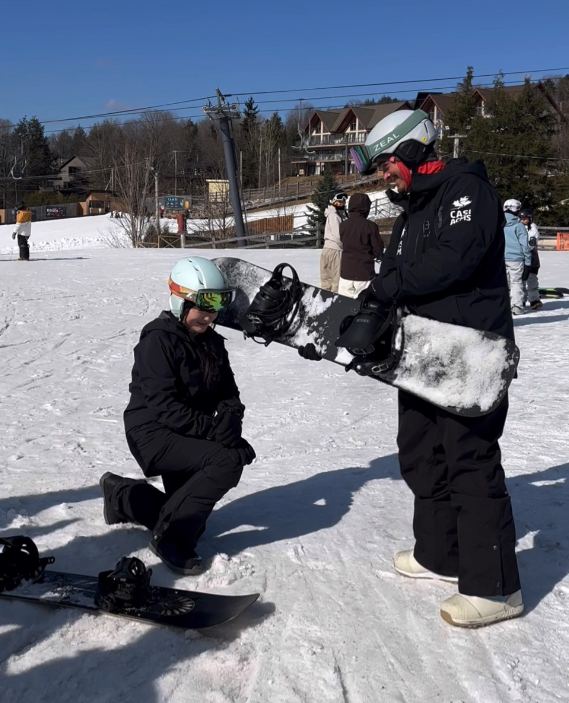
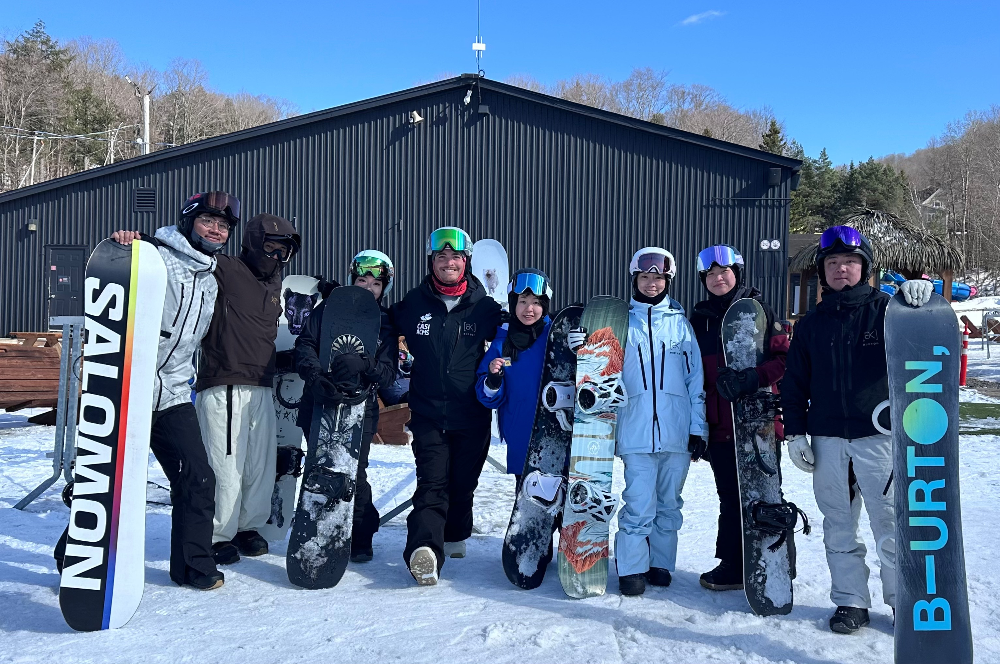



<a class="btn btn-lg btn-primary me-3 mb-4" href="/docs/">
  View My Projects <i class="fas fa-arrow-alt-circle-right ms-2"></i>
</a>
<a class="btn btn-lg btn-secondary me-3 mb-4" href="https://github.com/iriswork0831">
  GitHub <i class="fab fa-github ms-2 "></i>
</a>
<h2 class="mt-5" style="font-size: 2.5rem; font-weight: bold;">AI/ML Engineer & Solution Architect</h2>



{}
Welcome! I'm Iris Wang. I am an AI/ML Solution Architect driven by deep curiosity and a passion for transforming complex problems into elegant, human-centered solutions. 

With a background in Mathematics, Computer Science, and Management Analytics (4.0 GPA) from McGill University, I bring both technical precision and creative vision to every project I undertake.

I thrive at the intersection of data, design, and empathy — combining rigorous analytical thinking with a genuine understanding of user needs. My work spans from developing LLM-powered healthcare tools for aphasia patients to building scalable data-driven systems and predictive models that bridge technology and impact.

Recognized for being a fast learner, sharp problem-solver, and compassionate collaborator, I am committed to leveraging AI responsibly to build systems that not only perform intelligently but also serve meaningfully.

{}

{}
{}
Developing intelligent systems that bridge technology and human needs, from healthcare applications to predictive analytics.
{}

{}
Transforming complex datasets into actionable insights using advanced analytics and machine learning algorithms.
{}

{}
Building scalable, maintainable solutions with modern technologies and best practices.
{}

{}

{}
# Snowboarding & Flow  
{.text-center}

After finishing my undergrad, I felt a bit lost — I was searching for a software development role, but fixing bugs every day didn’t feel like the kind of problem-solving I loved.  
That changed when I discovered **snowboarding**. It grounded me, reconnected me with flow, and reminded me how much I love learning through movement and challenge.  

In my very first season, I earned my **CASI Level 1 Instructor Certificate**, and now I’m passionate about **freestyle and park riding** — constantly pushing myself to improve while enjoying every fall, turn, and breakthrough.  

It’s become more than a sport — it’s a mindset: **balance, adaptability, and flow**, the same principles I bring to my work in AI.

  

    
  

  

    
  

{}

{}
This is the another section
{.h1 .text-center}
{}