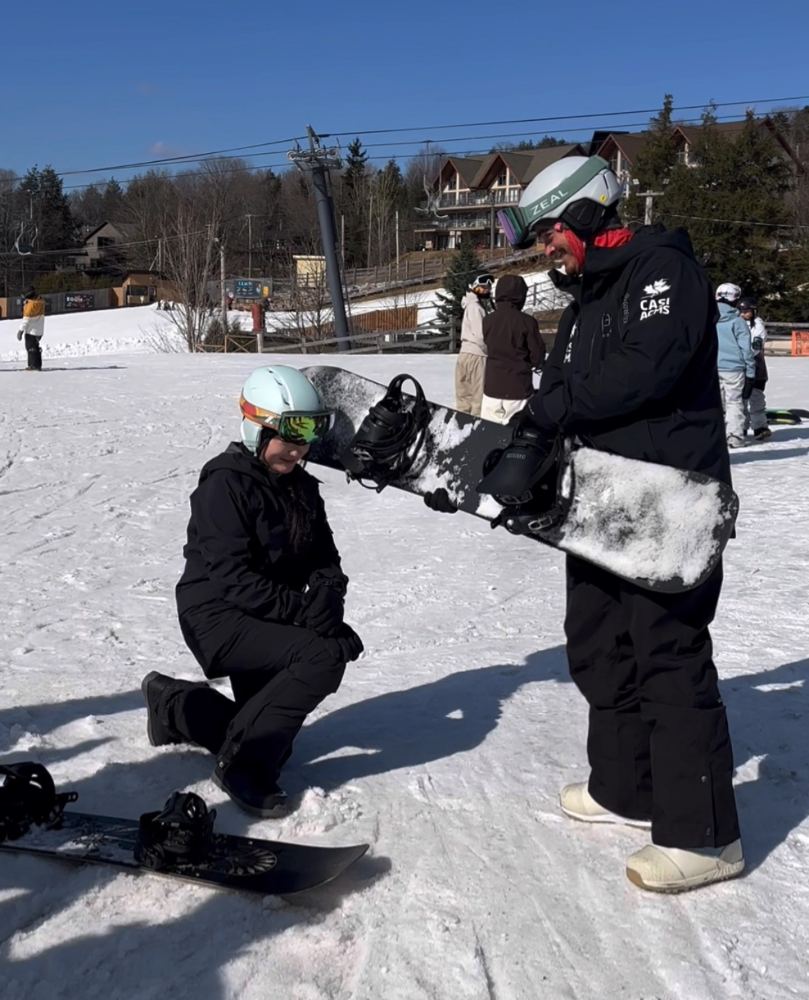
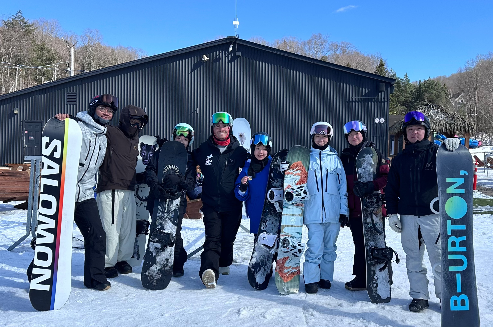
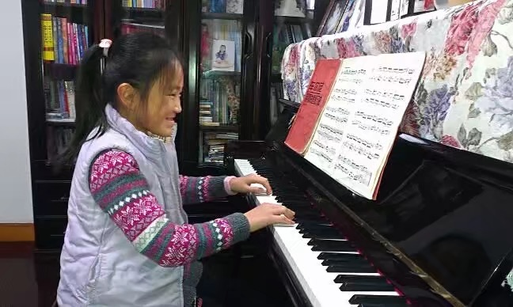
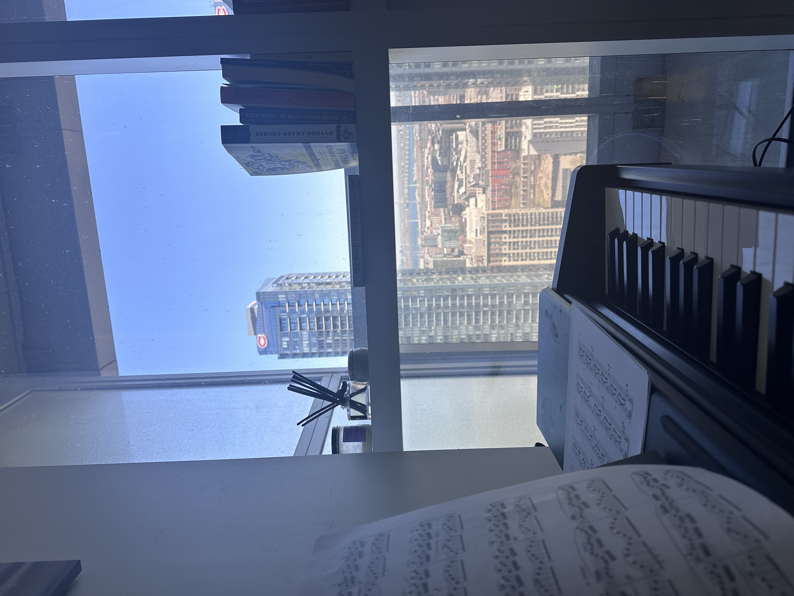
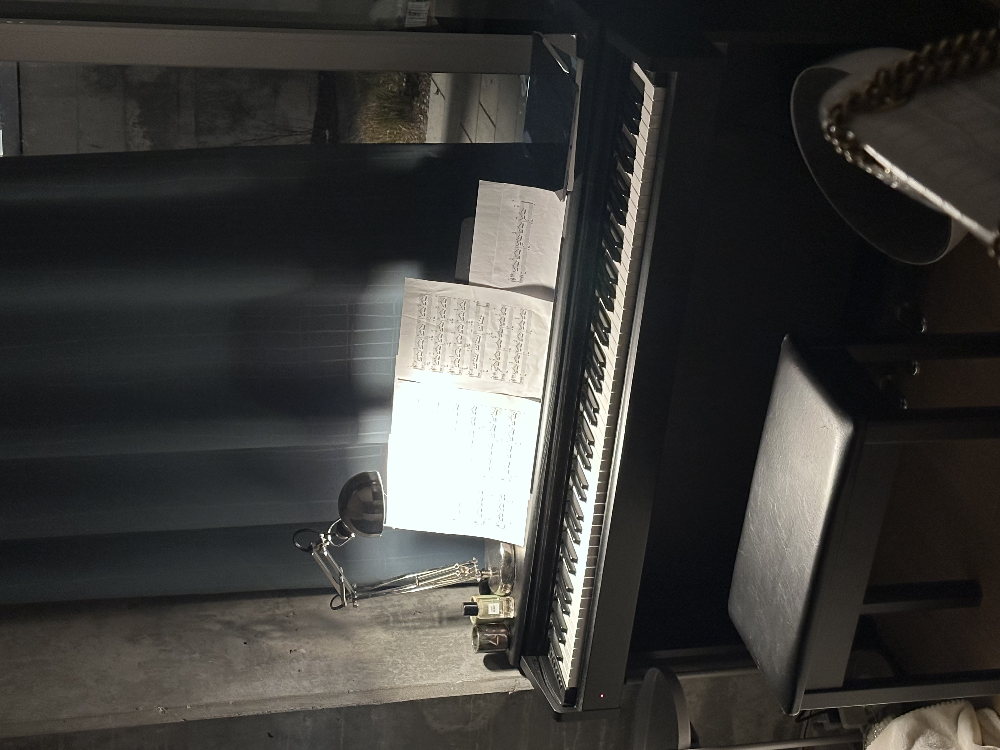

{}

<h2 class="mt-5" style="font-size: 2.5rem; font-weight: bold;">Iris Wang</h2>

{}

{}
{.text-start}

I was born and raised in Shanghai, China, where curiosity was part of everyday life.   

A full scholarship brought me to Vancouver for an exchange program — a city full of greenery and rain. I soon realized I wasn’t built for endless cloudy days, so I moved to Montreal to study at McGill University, where I found both challenge and clarity.     

I’ve always loved **trying new things** — from exploring different fields of study to discovering the joy of snowboarding, where I earned my **CASI Level 1 certificate** after my very first season. I see every new skill as a small experiment in growth.     

With the help of large language models (LLMs), I began to see how the knowledge I’ve built — in mathematics, computer science, and analytics — can truly **help people solve real problems**. That realization led me toward becoming a **Solution Architect**, someone who connects technology with human needs.     

I don’t limit myself. I’m **always ready for new challenges**, open to opportunities, learning, and exposure.   

"If there's one thing that will always make me happy, that's learning. "

{}

{}

# My Journey
{.text-center}

## Background
I'm currently exploring opportunities in AI/ML, with experience in multiple fields including Medical and Consulting 

## What Drives Me
I'm driven by the challenge of utilizing AI and machine learning algorithms to solve real-world problems and help people. My curiosity makes me a fast learner and constantly pushes me to explore how data, empathy, and logic intersect — turning complex problems into clear, impactful solutions. I believe AI should empower people and make technology feel human.

{}

{}

# Interests
{.text-center}

## Snowboarding & Flow  

After finishing my undergrad, I felt a bit lost — I was searching for a software development role, but fixing bugs every day didn’t feel like the kind of problem-solving I loved.  
That changed when I discovered **snowboarding**. It grounded me, reconnected me with flow, and reminded me how much I love learning through movement and challenge.  

In my very first season, I earned my **CASI Level 1 Instructor Certificate**, and now I’m passionate about **freestyle and park riding** — constantly pushing myself to improve while enjoying every fall, turn, and breakthrough.  

It’s become more than a sport — it’s a mindset: **balance, adaptability, and flow**, the same principles I bring to my work in AI.

  

    
  

  

    
  

{}

{}

## Piano & Expression  

I started playing the **piano at age four**, with parents who always encouraged me to learn at my own pace. They never forced me to follow the traditional path — when I didn’t enjoy classical music as a kid, they let me explore and play what I loved.  

That freedom shaped how I express myself today. As an adult, I’ve grown to appreciate classical pieces deeply — but I also love **re-imagining my favorite songs** and turning them into my own piano versions. It’s become my way of **releasing stress and grounding myself** after long days.  

No matter where I live — renting or not — there’s always a piano waiting for me. It’s my constant companion, a quiet anchor that keeps me balanced and inspired.  

It's more than music — it's my **language of calm and creativity**.  

  

    
  

  

    
  

  

    
  

{}

{}

# Let's Connect!
{.text-center}

I'm always interested in new opportunities and collaborations. 
Feel free to reach out if you'd like to discuss projects or just chat about technology!

**Email**: iriswork0831@gmail.com  
**LinkedIn**: [Iris Wang LinkedIn](https://www.linkedin.com/in/iris-yiwei-wang/)  
**GitHub**: [Iris Wang GitHub](https://github.com/iriswork0831)

{}